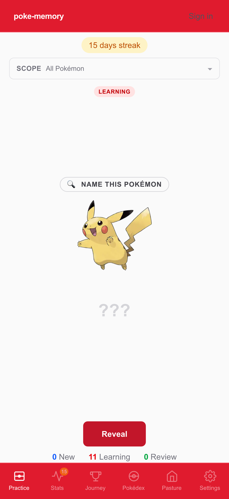
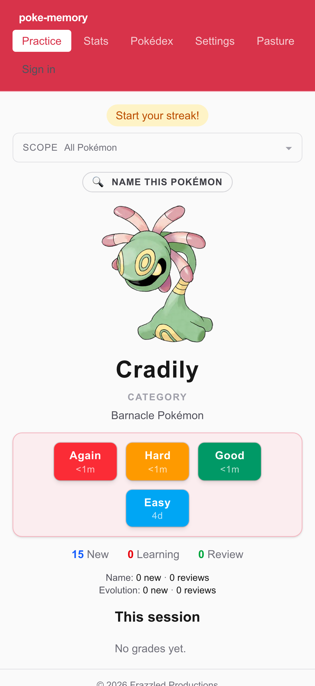
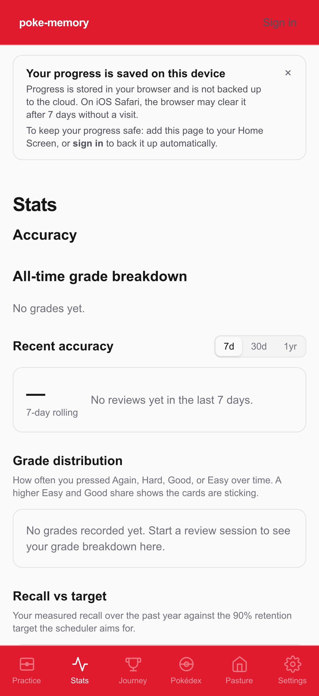
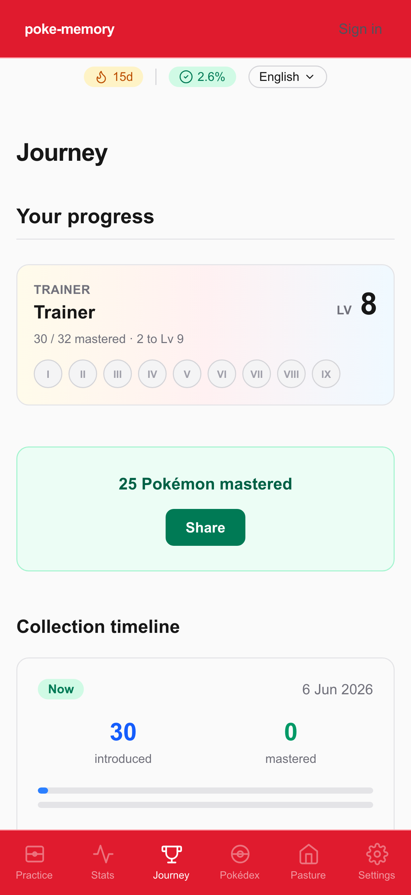
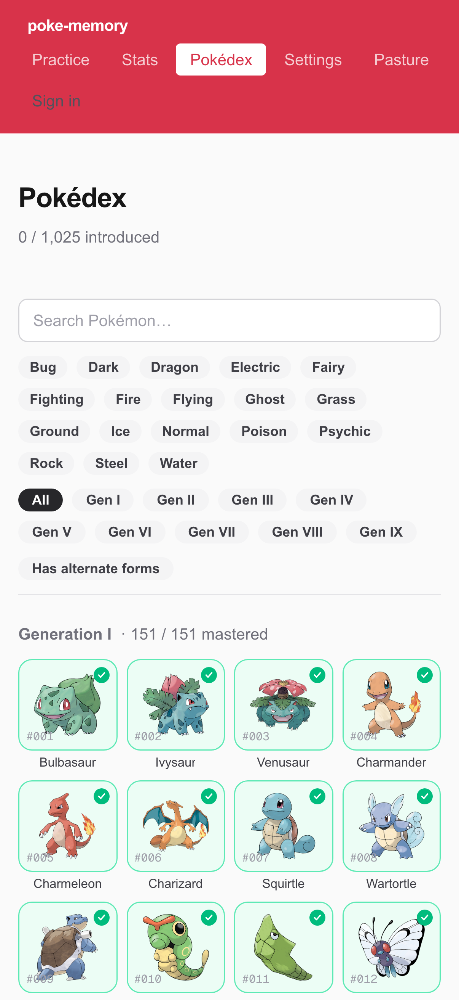
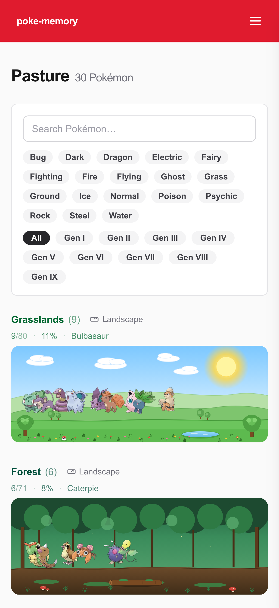

# poke-memory

[](https://github.com/Frazzled-Productions/poke-memory/releases)
[](https://github.com/Frazzled-Productions/poke-memory/blob/main/.github/stats/users.json)

<p align="center">
  
  
  
  
  
</p>

### Can you actually name all 1025 Pokémon?

**poke-memory** is a spaced-repetition app that gives you a fighting chance. Each species becomes a flashcard. You grade yourself on each one. An Anki-style scheduler decides when the card comes back - easy ones drift out to weeks and months, the ones you fluff come back tomorrow.

**[pokememory.com](https://pokememory.com)** - try it now, no sign-in needed.

## Screenshots

<p align="center">
  
</p>
<p align="center"><em>Card flip in action - Pikachu front, Reveal, then grade buttons. Loops automatically.</em></p>

<p align="center">
  
  &nbsp;
  
  &nbsp;
  
</p>
<p align="center">
  
  &nbsp;
  
  &nbsp;
  
</p>
<p align="center"><em>Practice (front and flipped), Stats, Journey, Pokédex, and Pasture - captured on iPhone 17 Pro.</em></p>

## How a review works

Each species gives you up to three cards, scheduled independently:

- **Forward** (default on) - sprite shown, name revealed on flip.
- **Reverse** (default off, enable in Settings) - name shown, sprite revealed on flip.
- **Cry → name** (default off, enable in Settings) - cry plays as the prompt, sprite + name revealed on flip. Species without a cry are skipped automatically.

Hit **Reveal**, then **Again / Hard / Good / Easy**. New cards step through a short learning queue (1m → 10m) before graduating to the day-scale schedule. After that, every passing grade stretches the interval; a fail drops the card back into a 10-minute relearning step. A typical trajectory:

| When you grade it | Grade | Next due |
|---|---|---|
| First time seeing it | Good | 1 minute |
| 1 minute later | Good | 10 minutes |
| 10 minutes later | Good | tomorrow *(graduates)* |
| Day 2 | Good | 6 days |
| Day 8 | Good | ~15 days |
| Day 23 | Easy | ~6 weeks |
| Day 65 | Again | 10 minutes *(lapse → relearn)* |

## Install on iPhone

Open the live demo in Safari, tap **Share → Add to Home Screen**. Tapping the icon opens the app in standalone mode - no Safari chrome - with a Pokédex-themed icon. It looks and feels like a native app, but everything still runs in the browser.

## Features

### Practice
The daily review loop. Live **Again / Hard / Good / Easy** tally for the current session, with a streak badge that ticks up each day you review. Misclick on a grade? Hit **Undo** (or ⌘/Ctrl+Z) to roll the most recent grade back. Optional **Scope** control narrows the session to specific generations, types, or preset groups (Starters, Legendaries). **Audio mode** keeps the screen awake and plays the cry on every reveal. When the day is done, a **Share today** button generates a Wordle-style summary you can paste anywhere.

### Stats
The analytical dashboard: a 30-day **accuracy sparkline** with a 7-day rolling headline, all-time grade breakdown, grade distribution and weekly trend, retention-vs-target indicator, per-direction accuracy breakdown, difficulty histogram, a GitHub-style **365-day review heatmap**, daily activity chart, mastery-over-time chart, a 14-day **due-forecast bar chart**, and a struggling-card list.

### Journey
The celebratory home: trainer-card hero strip (level + generation badges), gym badge gallery, current streak, a four-cell **Records** card (longest streak, best review day, avg days to mastery, most-mastered week), mastery distribution rings, species-introduced ring, and mastered-by-type and per-generation breakdowns (each gen row deep-links into the Pokédex).

### Pokédex
1025-cell grid with progressive disclosure - unlearned Pokémon appear as silhouettes, reviewed Pokémon greyscale, mastered ones in full colour. Tap any cell to open a detail page that reveals more as you progress: types and flavour text unlock when you start learning; base stats, facts, and the evolution chain unlock once mastered.

### Pasture
A nav link that unlocks the moment you master your first Pokémon. Mastered Pokémon are placed into habitat-themed zones (grasslands, forest, mountain, open sea, cave, urban, and more), with newly arrived ones drawing a sparkle until you've seen them once. A miniature collection wall that grows as your mastery does.

### Settings
Mastery threshold, new/review caps per direction, reverse-card and cry-card toggles, and an **FSRS recall-target slider** (80% – 97%) that trades off review frequency against retention.

### Under the hood

- **FSRS scheduling** - the same algorithm Anki ships by default since 23.10, via [`ts-fsrs`](https://github.com/open-spaced-repetition/ts-fsrs). Anki-style learning steps wrap FSRS so brand-new cards behave familiarly; the ladders adapt to FSRS difficulty (easy cards graduate in 1m, medium cards keep the 1m/10m default, hard cards get 1m/5m/15m).
- **Daily streak** - review at least one card to keep it alive; missing today is forgiven if you reviewed yesterday.
- **Daily limits** - 10 new cards and 100 reviews per day by default, adjustable in Settings. Keeps the load sustainable.
- **Random Pokémon fact on each flip** - height, weight, type, genus, generation, catch difficulty, gender ratio, habitat, growth rate, and more. A new fact each flip.
- **Stable per-day shuffle** - order rotates daily so the same Pokémon doesn't always lead, but stays stable within a session.
- **All 1025 canonical Pokémon** - gen 1 through gen 9, no alternate forms.

## Sync your progress

Sign in with GitHub or Google (the **Sign in** button in the nav) to sync your review history across devices. Once signed in, every grade is pushed to the cloud immediately (with a short debounce to coalesce rapid re-grades), and a safety-net beacon flushes any unsent grades on tab close.

- **Guest mode** - no account needed; everything stays in your browser.
- **Sign in** - ties your session to a GitHub or Google account via Supabase Auth; data stored in Postgres.
- **Conflict picker** - if you have local progress *and* cloud progress when you sign in, you'll be asked which to keep.
- **Auto-pull on focus** - returning to a tab that's been in the background for ≥ 30 seconds silently pulls the latest cloud state and updates Stats and Pokédex without a page reload.
- Signing out leaves your local `localStorage` intact; you can continue as a guest without losing anything.

> **Note:** Supabase project URL and anon key must be configured (see `.env.local.example`). GitHub and Google OAuth redirect URIs must be added in the Supabase dashboard.

## Privacy

- **Guest mode**: your card and session data stays in your browser - nothing is transmitted to any server we control. Sprites are self-hosted on the same Vercel deployment. Anonymous, aggregate telemetry (URL path, referrer, country, device type, Core Web Vitals) is collected by Vercel Analytics and Speed Insights; it does not include card progress, review history, or any personally identifying information.
- **Signed in**: your per-card FSRS state (stability, difficulty, scheduledDays, reps, lapses, fsrsState, due date, last review, first seen) is stored in Supabase Postgres, accessible only to you via Row-Level Security. Signing out leaves local progress intact.

## Run locally

The required Node major is declared in `.nvmrc` (currently Node 24); CI enforces
it and the build fails fast with an actionable message if you run under a
different major.

```bash
# With nvm:
nvm install   # reads .nvmrc; only needed once per major
nvm use       # picks up .nvmrc automatically

# If nvm use appears to succeed but your node --version still shows the wrong
# major, your ~/.nvm/versions/node directory may be empty (common when Node
# was installed via Homebrew rather than nvm). Run nvm install first.

# With Homebrew (no nvm needed) — replace 24 with the major in .nvmrc:
export PATH="/opt/homebrew/opt/node@24/bin:$PATH"
```

```bash
npm install
npm run seed           # one-time fetch of all 1025 species from PokéAPI (~1–2 min)
npm run seed:sprites   # one-time pre-generate WebP sprite variants (~1–2 min)
npm run dev            # http://localhost:3000
```

The seed step writes `lib/pokemon/generated.json` and downloads raw PNGs to `public/sprites/pokemon/`. Both are committed to the repo, so the seed is only required if those files are missing or you want to regenerate them (e.g. after a new Pokémon generation ships).

`npm run seed:sprites` converts the raw PNGs to optimised WebP at each render width and writes them under `public/sprites/pokemon/webp/`. These files are also committed, so this step is only required if the WebP tree is missing or a new size constant has been added to `lib/sprites/sizes.ts`.

Pre-generated name audio under `public/audio/names/` is likewise committed. To regenerate it - for example after a new generation ships - set `GOOGLE_CLOUD_TTS_API_KEY` in `.env.local` and run `npm run seed:tts`.

### Other scripts

```bash
npm test           # vitest (unit + component)
npm run typecheck  # tsc --noEmit
npm run lint       # eslint
npm run build      # next build
```

### E2E tests

```bash
npx playwright install          # one-time browser install
npm run test:e2e                # runs against http://localhost:3000
```

E2E smoke tests run automatically against Vercel preview deployments in CI.

## Stack

- **Framework** - Next.js 16 (App Router, Cache Components)
- **UI** - React 19, Tailwind CSS 4
- **Language** - TypeScript 6
- **Sync** - Supabase (Auth + Postgres with RLS)
- **Hosting** - Vercel (auto-deploys on every push to `main`)
- **Testing** - vitest for unit/component, Playwright for E2E

## Development

This repo doubles as a sandbox for practicing Claude Code sub-agent workflows. The custom agent roster, orchestration playbook, and project conventions live in [AGENTS.md](./AGENTS.md). Agent definitions are in [`.claude/agents/`](./.claude/agents/).

## Status

Hobby project, work-in-progress. See [CHANGELOG.md](./CHANGELOG.md) for what's been built so far and [Releases](https://github.com/Frazzled-Productions/poke-memory/releases) for tagged versions.

## Licence

The project's own source code is released under the [MIT Licence](./LICENSE).

Bundled Pokémon assets - sprites, cries, and names - are **not** covered by that licence. They remain the intellectual property of Nintendo, Game Freak, and The Pokémon Company.

## Disclaimer

Poké Memory is an unofficial fan project. It is not affiliated with, endorsed by, or in any way connected to Nintendo, Game Freak, or The Pokémon Company.

Pokémon and all related names, characters, sprites, cries, and other creative assets are trademarks and/or copyrights of Nintendo / Creatures Inc. / GAME FREAK inc. All rights remain with their respective owners.

Pokémon species data and sprites are sourced from [PokéAPI](https://pokeapi.co/) (an open Pokémon data API) and are used here for fan and educational purposes. Sprites are self-hosted and served as static files from the same infrastructure as the app - no runtime requests are made to PokéAPI or any Nintendo-affiliated server.
